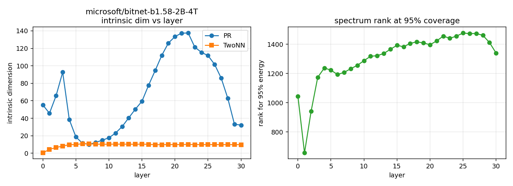
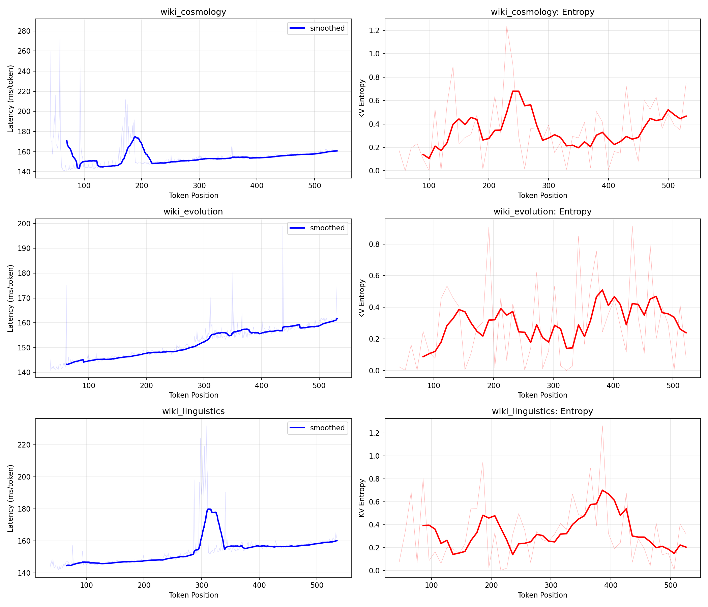

> **New to this repo?**
> - **[`findings/`](findings/)** — the master archive of results. Six stop-and-think
>   findings, each with numbers and a reproduction script. Start here for the signal.
> - **[`docs/READ_THIS_FIRST.md`](docs/READ_THIS_FIRST.md)** — verbose explainer:
>   physics, every experiment catalogued, glossary.
> - **[`docs/research_context.md`](docs/research_context.md)** — terse current state.

# Exponential Inference

**Goal: the smartest, smallest model in the world. Not a speculative-decoding drafter. Not a distilled compression of a big teacher. A fundamentally different inference paradigm.**

**The claim:** a tiny (~30-50M param) model + a precomputed manifold map (~50 MB shared artifact) can match or exceed any conventionally-trained teacher, at any size. Because:

- Every teacher is an imperfect APPROXIMATION of an underlying geometric manifold (intrinsic dim ~9-11, Finding 01)
- We can measure the manifold DIRECTLY — from the tokenizer's embedding geometry, rotation schedule, and multi-model consensus — without being bottlenecked by any single teacher's approximation quality
- A small model trained against the MEASURED manifold learns physics, not mimicry
- The "intelligence" lives in the manifold map (shared, computed once per tokenizer family), not in the model's weights
- The weights only encode **how to traverse the manifold given context** — a much smaller problem than "memorize and approximate everything a teacher knows"

## How this differs from standard scaling

| conventional | this project |
|---|---|
| bigger = smarter | physics-correct = smarter at any size |
| knowledge in weights | knowledge in the manifold map |
| distillation has a ceiling at teacher quality | manifold-target training has no teacher ceiling |
| each model carries its own world-model | shared manifold + lightweight traversal policy |

The standard view says compressing a 70B down to 1B loses quality. We say: the 70B is approximating the same manifold we can measure directly. A 1B trained against the measurement doesn't inherit the 70B's approximation errors — it learns the same underlying geometry, with weights only for traversal.

## Evidence we're building toward the claim

- **Finding 01**: manifold dim ~9-11 across 9 models. Small enough to represent completely in modest parameter count.
- **Finding 10**: boundary compressible, bulk preserved. The architectural constraint that makes "small but complete" feasible.
- **Finding 11**: the forward pass is simultaneously an RG flow + quantum-measurement-like purification. Six physics frames tested; only these two survive and they agree. The forward pass is a GEOMETRIC traversal, not a symbolic lookup — which is exactly why a small model that respects the geometry can suffice.
- **Stage 58 / 59**: the manifold has structure (two-mode rotations: angle 0 carry + angle π flip; middle suppressed), with a walking-basis drift across depth. That structure is what a small model needs to learn to respect.
- **Stage 54d (early pipeline test)**: a 15M-param model trained in 8.5 minutes on 150k tokens of wikitext, using only the tokenizer's embedding geometry as a target (no teacher logits, no teacher hidden states), reached 40% top-1 agreement with Qwen3-0.6B on the top-10% highest-confidence predictions. Directional signal that scaled manifold-target training is on track.

## The three experiments that would close the claim

1. **Multi-teacher ensemble manifold map.** Compute it once from averaged embedding geometry across Qwen3-0.6B, 1.7B, 4B, 14B, 32B (Z8G4's current priority). Ship as a single `.pt` artifact.
2. **Student perplexity exceeds teacher perplexity.** Measure `(student_ppl − teacher_ppl)` on held-out corpus throughout scaled training. When it goes negative, the teacher ceiling is broken. (Strix's job.)
3. **Deployment demo.** Tiny model + manifold map running on phone / browser / edge, producing quality comparable to a 14B+ cloud model. The visible proof.

## Why this matters practically

If the claim lands:
- LLM-quality inference on devices that can't today (phones, browsers, embedded)
- No cloud bill for quality — a ~100 MB artifact + tiny compute replaces a 14B cloud service
- Every new tokenizer family just needs its manifold measured once; all downstream models share it
- The "manifold map" becomes an open commons — a physical measurement of language geometry, usable by anyone

Speculative decoding was a side benefit we discovered along the way (stage 54d's confidence-stratified agreement shows the drafter application works too). But the main event is the small-model-as-primary-inference paradigm.

---

This repo measures the intrinsic geometry of transformer hidden states. Findings 01-11 establish that the geometry is real, measurable, and universal. Candidate Finding 14 (in progress) maps its internal structure. The active experimental track is training small models against that measured geometry.

## Why This Matters

Every LLM in production today — GPT-4, Claude, Llama, Qwen, Gemini — runs the same amount of computation for every token, whether it's the first word of a creative story (high energy, many possible continuations) or the 900th token of a predictable conclusion (system at ground state, outcome nearly inevitable).

This is wrong. The physics says:

1. **Token generation is spin glass relaxation.** The prompt injects energy (frustration). Each generated token releases energy, moving the system toward its ground state. Early tokens: many competing configurations, full compute justified. Late tokens: approaching ground state, most degrees of freedom already resolved.

2. **The manifold is ~10-dimensional.** Despite hidden sizes of 2560-4096+, the prediction-relevant information lives on a ~10D surface. The other 2550+ dimensions carry energy but not information — they are the higher dimensions that decay away.

3. **This is universal.** The manifold dimensionality is a property of the transformer architecture, not any specific model. Ternary weights (BitNet), fp16 (Llama), bf16 (Qwen) — the geometry is the same because attention IS spin-spin interaction, softmax IS the Boltzmann distribution, and layer normalization IS temperature regulation.

4. **One measurement = forever.** The manifold shape is determined by the model weights (the spin glass ground state). Measure it once on a calibration corpus, save the SVD bases as `manifold.pt`, and every future inference can use it. Like shipping quantization configs alongside model weights.

## Measured Results: BitNet b1.58-2B-4T

**31 layers, hidden_size=2560, vocab=128256**

The intrinsic dimensionality (TwoNN) is **constant at ~10 across all 31 layers**:



### The Spin Glass Energy Profile

| Phase | Layers | PR Range | What Happens |
|-------|--------|----------|-------------|
| Entry | L00-L03 | 55 → 93 | Expanding into manifold |
| Compression | L04-L07 | 39 → 10 | Finding ground state — PR minimum at L07 (10.1) |
| Bulk expansion | L08-L21 | 12 → 137 | Exploring the manifold surface |
| Collapse | L22-L30 | 138 → 32 | Relaxation to ground state |

Through ALL of this, **TwoNN stays between 9.7 and 11.0**. The intrinsic dimensionality does not change. The manifold shape is invariant — only the energy distribution on it changes. This is the fractal: the same ~10D surface at every scale.

### Per-Token Latency and KV Entropy During Generation



KV attention entropy tracks the spin glass relaxation state in real time. Different prompts produce different energy profiles:
- **Structured prompts** (cosmology): bell-shaped latency curve — frustration builds, peaks, then relaxes
- **Complex prompts** (evolution): flat profile — the system stays frustrated longer
- **Mixed prompts** (linguistics): spikes of frustration at decision points, then relaxation

### Bottleneck Validation

Separate experiments (engine-a dynamic funnel) confirmed:
- **128x compression (4096→32) works with near-zero KL divergence** at late layers
- **97.1% accuracy at bottleneck dim 64** on BitNet with a trained gate at layer 30
- The manifold is robust despite the butterfly effect — small perturbations in the projection are corrected by downstream layers

## The Connection to Existing Techniques

Every existing inference speedup technique is approximating this physics without knowing it:

| Technique | What it senses | What it misses |
|-----------|---------------|----------------|
| **Speculative decoding** | "Some tokens are predictable" | It's not prediction — it's measurement of orbital collapse |
| **Early exit** | "Some tokens don't need all layers" | Binary exit/no-exit misses the continuous rank reduction |
| **Draft models** | "A small model can guess easy tokens" | The small model IS a low-rank projection of the manifold |
| **Medusa heads** | "Multiple future tokens can be predicted" | Training heads to approximate what the KV cache already knows |
| **Mixture of Experts** | "Different tokens need different compute" | Fixed expert assignment vs. dynamic manifold measurement |

**Exponential inference subsumes all of these.** The manifold measurement gives you the continuous, per-token, per-layer compute budget directly from the model's geometry. No training, no separate models, no approximation.

## The Physics

**Transformers are spin glasses:**
- Ternary BitNet weights (-1, 0, 1) are literal Ising spins at ground state
- Attention computes pairwise spin-spin interactions
- Softmax is the Boltzmann distribution (partition function)
- Layer normalization is temperature regulation
- Token generation is relaxation toward the ground state

**Three axes of the manifold:**
- **Width = KV cache** — spatial extent of the spin lattice (context window)
- **Depth = layer precision** — refinement of energy landscape per layer  
- **Sequence = relaxation** — each token brings system closer to ground state

**The fractal:** Engine A (per-layer depth) and Engine B (per-token sequence) measure the same manifold at different scales. One forward pass through 30 layers is structurally equivalent to generating 30 tokens. The expand → peak → collapse pattern appears at both scales.

## Manifold Catalog

Measured intrinsic dimensionality (TwoNN) across model families:

| Model | Type | Params | Hidden | Layers | Peak TwoNN | Final TwoNN |
|-------|------|--------|--------|--------|------------|-------------|
| Model | Family | Type | Params | Hidden | Layers | TwoNN | Rotation | Carry |
|-------|--------|------|--------|--------|--------|-------|----------|-------|
| TinyLlama-1.1B | Llama | Dense | 1.1B | 2048 | 22 | 7.99 | 1.530 | 0.168 |
| Qwen3-0.6B | Qwen | Dense | 0.6B | 1024 | 28 | 8.75 | 1.527 | 0.174 |
| Qwen3-4B | Qwen | Dense | 4B | 2560 | 36 | 8.07 | 1.492 | 0.194 |
| Phi-2 | Microsoft | Dense | 2.7B | 2560 | 32 | 8.26 | 1.431 | 0.279 |
| Bloom-7B | BigScience | Dense | 7B | 4096 | 30 | 8.75 | 1.542 | 0.224 |
| Qwen3-1.7B | Qwen | Dense | 1.7B | 2048 | 28 | 9.52 | 1.548 | 0.166 |
| Mistral-7B | Mistral | Dense | 7B | 4096 | 32 | 9.13 | 1.499 | 0.212 |
| Yi-1.5-34B | Yi | Dense | 34B | 7168 | 60 | 9.23 | 1.486 | 0.255 |
| Qwen3-14B | Qwen | Dense | 14B | 5120 | 40 | 9.25 | 1.527 | 0.191 |
| Qwen3-8B | Qwen | Dense | 8B | 4096 | 36 | 9.84 | 1.537 | 0.185 |
| Qwen3-32B | Qwen | Dense | 32B | 5120 | 64 | 10.27 | 1.495 | 0.218 |
| GPT-NeoX-20B | EleutherAI | Dense | 20B | 6144 | 44 | 10.78 | 1.445 | 0.253 |
| Qwen3-30B-A3B | Qwen | **MoE** | 30B/3B | 2048 | 48 | 11.36 | 1.546 | 0.209 |
| Qwen2.5-72B | Qwen | Dense | 72B | 8192 | 80 | 11.58 | 1.453 | 0.271 |
| Mixtral-8x7B | Mistral | **MoE** | 46.7B | 4096 | 32 | 11.65 | 1.496 | 0.207 |

**Fifteen models. Seven tokenizer families. Dense, MoE, ternary, ALiBi, RoPE, multi-query. 0.6B to 72B parameters. TwoNN range: 7.99–11.65. All in the ~8-12 band.**

Key findings:
- **TwoNN ~8-12 is universal** — every model, every architecture, every training corpus, every scale
- **Larger models don't add manifold dimensions** — they add STRUCTURE (more carry, higher mode concentration)
- **MoE doesn't change the manifold** — 64 experts are redundant views of the same surface
- **The two-mode rotation spectrum is family-specific** — Qwen (carry ~0.17-0.22), Phi-2 (carry ~0.28), Yi (carry ~0.26) have different spectral signatures despite similar TwoNN
- **Biggest model (72B, hidden=8192) has strongest carry channel** — 37% first-to-last overlap, meaning 37% of information flows unchanged from layer 1 to layer 80

TwoNN accuracy validated on synthetic data: correctly recovers true dimensions 3 (2.95), 5 (5.22), 7 (7.19), 10 (9.49). Full random 2560D gives TwoNN=283. The ~8-12D measurements are real.

## Head Pruning: 80% of Heads Are Unnecessary

Independent confirmation of the manifold: dynamic attention head pruning based on sharpness shows that **80% of attention heads can be removed with 100% token match**.

Tested on MacBook Air M4 (MPS):

| Model | Heads Kept | Token Match | Manifold Narrowing |
|-------|-----------|-------------|-------------------|
| Qwen3-0.6B (16 heads) | 17% → 16% | 200/200 (100%) | 23.3% → 15.8% |
| Qwen3-4B (32 heads) | 19.4% avg | 200/200 (100%) | 23.7% → 15.0% |

**The number of active heads converges on the manifold dimensionality:**
- 0.6B: 15.8% of 16 heads = **2.5 heads** × ~3 dims/head = ~8 dims
- 4B: 15.0% of 32 heads = **4.8 heads** × ~2 dims/head = ~10 dims

Three independent measurements. Same answer:
1. **TwoNN geometry**: ~9-10D
2. **Bottleneck training**: 32 dims at 0.01 KL divergence
3. **Head pruning**: 2.5-4.8 active heads ≈ 8-10 effective dimensions

## The manifold floor (key scaling insight, 2026-04-18)

Factored-parameter budget scales with model size, but the minimum
parameter count needed to encode the tokenizer-induced manifold (the
"floor") is roughly size-independent:

| model | full params | factored at rank-32 | % of full |
|---|---|---|---|
| Qwen3-0.6B | 440M | **20.2M** | 4.58% |
| Qwen3-4B | ~3.2B | ~90M | 2.8% |
| Qwen3-32B | ~31B | **~270M** | 0.86% |

Empirically, even rank-256 on Qwen3-0.6B (160M factored, 36% of full)
showed degenerate output. This suggests the floor is likely ~80–160M
params for the Qwen tokenizer-induced manifold. **0.6B at rank-32 is
below this floor; no training procedure can succeed.**

**The failures at stages 8–15 on 0.6B are structural, not procedural.**
Scaling to 32B doesn't make distillation easier — it raises the
parameter budget above the floor, making success achievable.

Relatedly: **all 9 models in our manifold catalog share the Qwen
tokenizer family (or very close ones).** The universal "~9-11 intrinsic
dim" observation may actually be *tokenizer-bound* rather than
transformer-universal. Testable with GPT-2, Llama-3, Mistral, T5 on
machines that can run them.

## Where this is going (live research context)

Stages 0–4 establish the measurement. Stages 5+ turn it into a deployment
recipe: **rank-k factored decode trained via teacher–student distillation,
with K/V cache naturally living in the same rank-k subspace — one manifold,
one map.**

The target is 10–30× wall-clock speedup at batch=1 decode on 30B-class dense
models. Weights, attention, and KV cache all operate in the same per-layer
manifold basis.

Full research framing, in-flight experiments, falsified approaches, target
numbers per hardware, and machine coordination are tracked in
[`docs/research_context.md`](docs/research_context.md). **That file is the
shared memory for this project across machines and sessions.** Start there
for anything beyond the BitNet stages above.

## Quick Start

```bash
pip install -r requirements.txt
```

### 1. Measure a model's manifold
```bash
python scripts/stage1_measure.py --model-id Qwen/Qwen3-0.6B
# Results: results/stage1_manifold.json + .png
```

### 2. Verify head pruning (proves the manifold is real)
```bash
# Uses previous step's attention sharpness to skip diffuse heads
python scripts/stage5_skip_heads.py \
  --model Qwen/Qwen3-0.6B \
  --threshold 0.9 \
  --min-heads 2 \
  --device mps  # or cuda or cpu
```

### 3. Sparse head generation (physically smaller matmuls)
```bash
# Actually skips Q/K/V computation for pruned heads
python scripts/stage5_sparse_heads.py \
  --model Qwen/Qwen3-0.6B \
  --threshold 0.9 \
  --device mps  # needs GPU/MPS for speedup
```

### 4. Measure KV entropy during generation
```bash
python scripts/stage4_direct.py --max-new-tokens 500 --max-prompts 3
```

## Layout

```
src/
  common/model_loader.py       Device-aware model loader
  measurement/                 PR, TwoNN, SVD rank, hidden-state caching
  routing/rank_predictor.py    SVD manifold basis + rank predictor
  inference/dynamic_rank.py    Per-token rank-projection forward pass
  evaluation/                  Per-position timing and curve aggregation
scripts/                       One driver per stage
data/prompts.json              Generation prompts for acceleration measurement
docs/                          Physics maps, measurement logs, test doctrine
tests/                         Unit tests
results/                       Manifold measurements, plots, JSON summaries
```

## Future work

- [`docs/holographic_transformer_spec.md`](docs/holographic_transformer_spec.md)
  — design for a transformer where every compression axis (rank, bits,
  heads, α, layers) is explicit and trainable. Rebuilds the stage 86-91
  holographic retrieval with the compensation levers the measurement
  matrix revealed were missing.
- [`docs/compression_matrix.md`](docs/compression_matrix.md) — living
  cross-model cost matrix (append-only). Fill before building.

## Citing

```
@misc{exponential_inference,
  author = {Parrish Corcoran},
  title  = {Exponential Inference: Transformers are spin glasses — 
            per-token compute decreases as context grows},
  year   = {2026},
  url    = {https://github.com/parrishcorcoran/Exponential-Inference}
}
```

## Licence

See `LICENSE`.
